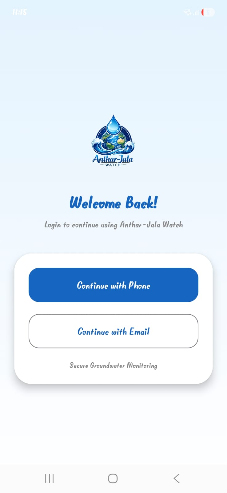
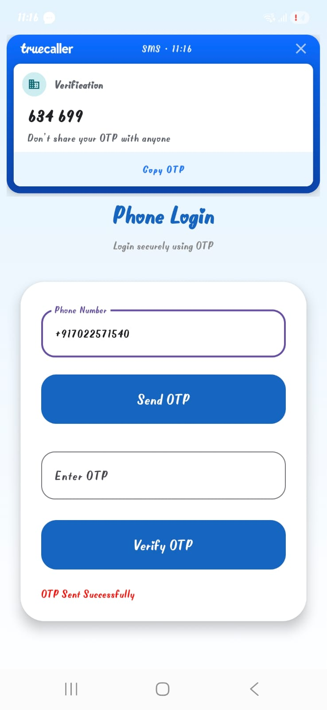
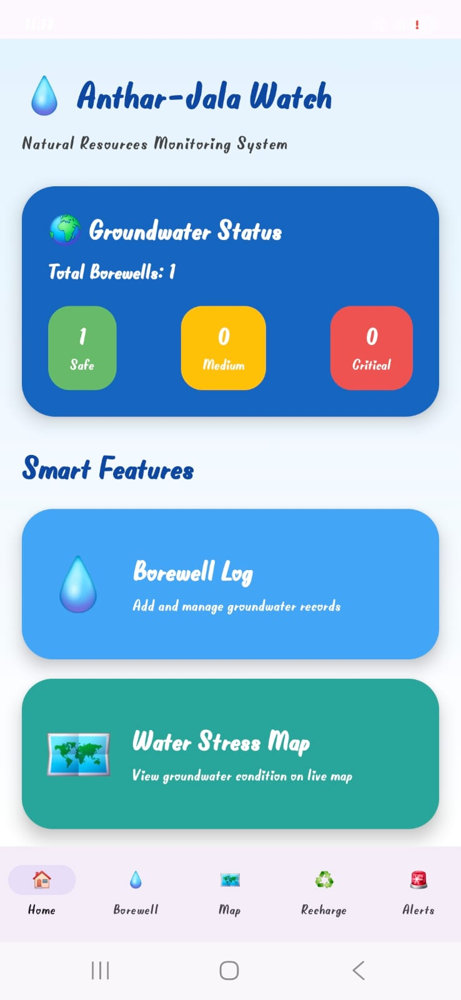
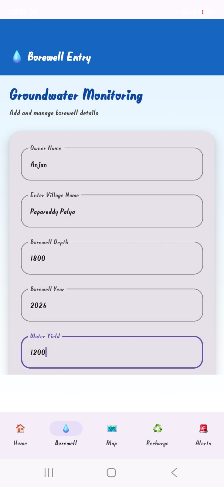
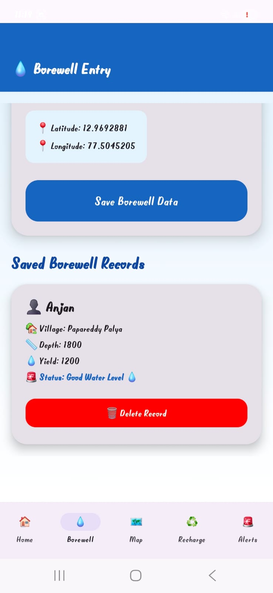
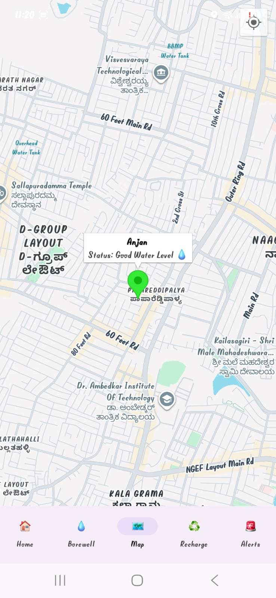
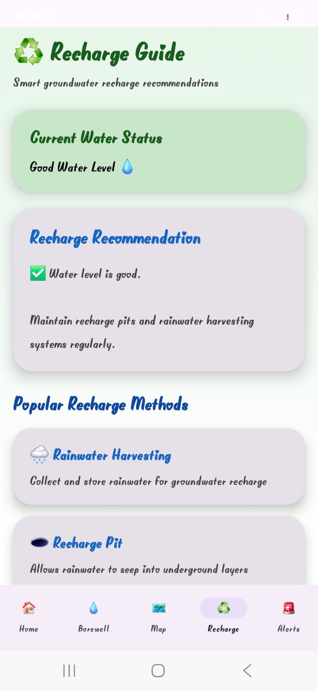
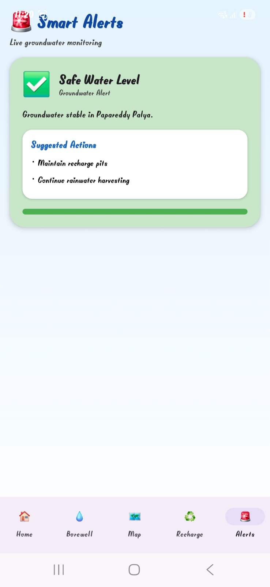

# AntharJalaWatch

## Project Title
AntharJalaWatch - Smart Groundwater Monitoring Application

---

# Problem Statement

Groundwater monitoring and management is difficult using traditional methods. This project provides a smart Android application to monitor groundwater conditions, manage borewell records, provide recharge guidance, and visualize groundwater status on maps.

---

# Features

- User Login System
- Phone OTP Authentication
- Google Sign-In
- Dashboard Monitoring
- Borewell Data Entry
- Live Groundwater Status
- Water Stress Map
- Recharge Recommendations
- Smart Alerts System
- Firebase Integration
- Modern UI using Jetpack Compose

---

# Technologies Used

- Kotlin
- Android Studio
- Jetpack Compose
- Firebase Authentication
- Firebase Firestore
- Google Maps API
- Material Design 3
- Git & GitHub

---

# Installation Steps

1. Clone Repository

```bash
git clone https://github.com/anjankumarSR/AntharJalaWatch.git
```

2. Open in Android Studio

3. Sync Gradle

4. Run the application

---

# Run Command

```bash
./gradlew assembleDebug
```

---

# Folder Structure

```text
AntharJalaWatch/
│
├── app/
├── screenshots/
├── gradle/
├── build.gradle.kts
├── settings.gradle.kts
└── README.md
```

---

# Screenshots

## Login Screen


## Phone Login


## Dashboard


## Borewell Entry


## Saved Records


## Map Screen


## Recharge Guide


## Smart Alerts


---

# GitHub Repository

https://github.com/anjankumarSR/AntharJalaWatch

---

# Future Improvements

- IoT Sensor Integration
- Real-time Water Quality Monitoring
- AI-based Prediction System
- Cloud Analytics Dashboard
- Push Notifications

---

# Author

Anjan Kumar S.R

GitHub:
https://github.com/anjankumarSR